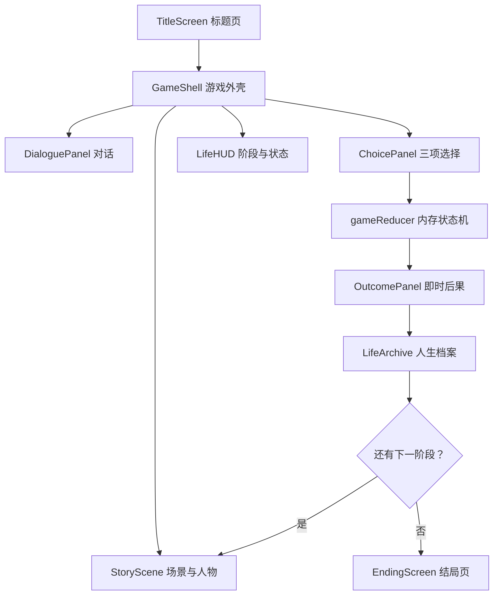

# 《余生协议》Next.js 演示原型设计规格

## 1. 目标

在当前目录中创建一个无需后端、登录或账号系统的 Next.js 互动叙事游戏。玩家从林一出生开始，依次经历婴儿、幼年、少年、青年、壮年、中年和老年七个阶段，在 AI 带来的安全、效率、自由、责任与生命延续之间作出选择，最终进入六种主要结局之一。

第一版必须是可以从标题页完整玩到结局页的演示性 MVP，而不是静态界面集合。重点是让用户感受到早期选择在多年后产生回响。

## 2. 已确定的产品边界

### 2.1 本期包含

- 标题页与开始游戏。
- 七个人生阶段的开场、对话、三选一、即时反馈和章节提问。
- 五项可见状态：自主、辨识、联结、保障、意义。
- 一项隐藏状态：公共影响力。
- 剧本中定义的关键标记、条件对白、关系变化、政策环境和延迟回响。
- 六种主要结局及附加人生评语。
- 人生档案：阶段进度、状态侧写、已发生选择和关键回响。
- 重新开始按钮。
- 桌面端与平板端演示，手机端保持可操作。

### 2.2 本期不包含

- 后端服务、数据库、API 路由或服务器状态。
- 登录、注册、账号、云存档或多用户系统。
- `localStorage`、Cookie 或其他持久化存档；刷新页面即重新开始。
- 配音、背景音乐、环境音或音频控制。
- 视频播片、动态 PPT 或 Canvas 游戏引擎。
- 自定义剧情编辑器、后台管理界面或内容管理系统。
- 多语言、排行榜、分享卡片、成就系统和数据分析。

## 3. 技术方案

- 框架：Next.js App Router、React、TypeScript。
- 样式：组件使用 CSS Modules，共享颜色、间距和动效参数使用全局 CSS 变量；不把完整 UI 烘焙到图片中。
- 动画：第一版只使用 CSS transition、keyframes 和浏览器原生能力，不增加 React 动画库。
- 状态：页面顶层 `useReducer` 管理单次游戏会话，所有状态只存在于浏览器内存。
- 内容：剧本转换为类型安全的 TypeScript 数据对象，与界面组件分离。
- 图片：使用 `next/image` 或背景图层加载现有场景 PNG 与透明角色 PNG。
- 测试：纯函数单元测试、关键交互组件测试、完整通关的浏览器测试。

项目作为纯前端静态演示运行，不依赖任何网络请求即可完成一次游戏。

## 4. 总体架构

架构分为三层：

1. **内容层**：七章剧本、选项、状态变化、标记和条件分支。
2. **规则层**：处理选择、限制状态范围、判断条件回响与最终结局的纯函数。
3. **表现层**：场景、角色、对话、选择、档案、动画和响应式布局。

表现层不能直接硬编码结局判断；规则层不能依赖 React 或浏览器 API。

## 5. 会话状态模型

一次游戏会话至少包含：

- 当前界面：标题、剧情、选择、后果、档案、结局。
- 当前阶段与当前剧情节点。
- 五项可见状态，数值限定为 0—5。
- 隐藏的公共影响力，数值限定为 0—5。
- 已获得标记集合。
- 七章的已选选项记录。
- 小满关系状态：未建立、羁绊、强化羁绊、决裂或失联。
- “栖”的交互倾向：托管型、共生型或工具型，由当前状态实时推导。
- 政策环境：技术优先、共生治理、人本限制或社会冲突。
- 最终结局与附加评语。

状态动作保持有限且明确，例如：开始游戏、推进对白、打开选择、提交选择、查看后果、进入档案、进入下一章、显示结局、重新开始。

刷新页面不会恢复会话；“重新开始”会把 reducer 恢复为统一初始值。

## 6. 核心游戏流程

### 6.1 标题页

- 使用出生协议室或城市背景的局部构图，不再生成标题海报。
- 展示标题《余生协议：一个普通人的100年》和一句核心文案。
- 主按钮为“开始这一生”。
- 次级信息说明本作包含 AI、数据权、资源分配与生命终点议题。

### 6.2 每章统一流程

1. 显示时间、年龄、地点和章节标题。
2. 播放短暂场景转入动画。
3. 玩家点击推进关键对白。
4. 三张选择卡进入画面；选项没有红绿好坏提示。
5. 选择确认后锁定，执行状态变化与标记写入。
6. 显示即时后果、状态增减和一条延迟回响提示。
7. 显示章节问题与人生档案摘要。
8. 玩家进入下一年龄阶段。

所有主要选择均不可在当前人生中撤销。玩家若想改变路线，需要使用“重新开始”。

### 6.3 结局流程

- 老年期选择后，由规则层根据保障、联结、公共影响力和关键标记判断六种结局之一。
- 结局页显示人生称号、结局叙述、最后一句话、五项状态侧写、三个关键延迟回响和社会政策遗产。
- 不显示分数、星级、胜利、失败或最佳路线。
- 结尾提供“重新开始另一生”。

## 7. 七阶段与美术映射

| 阶段 | 主场景 | 主要人物 |
|---|---|---|
| 婴儿 | `01-出生协议室-v1.png` | 婴儿林一、周岚、栖 |
| 幼年 | `02-青屿学习中心-v1.png`，条件切换 `03-旧公园-v1.png` | 幼年林一、小满、栖 |
| 少年 | `04-风险评估室-v1.png` | 少年林一、小满、栖 |
| 青年 | `05-人生规划中心-v1.png` | 青年林一、周岚、小满、栖 |
| 壮年 | `06-自动化工作与公共服务大厅-v1.png` | 壮年林一、小满、栖 |
| 中年 | `07-医疗决策室-v1.png` | 中年林一、老年周岚、小满、栖 |
| 老年 | `08-长寿医学中心病房-v1.png` | 老年林一、小满或其录像、数字周岚、栖 |

透明角色素材从现有独立 PNG 中按年龄映射。医生、职业顾问、研究员等非核心配角第一版使用画外对白、模糊剪影或无头像姓名牌，不新增立绘。

“昼海”分支第一版不增加背景图，使用工作大厅淡出后叠加代码生成的渐变海面、光点和漂浮界面，作为短暂分支反馈；若效果不足再单独生成素材。

## 8. 页面布局

### 8.1 桌面端

- 场景背景铺满视口，使用轻微裁切保持沉浸感。
- 顶部左侧显示阶段、年份和地点；顶部右侧提供人生档案与重新开始。
- 人物立绘位于背景预留区，采用最多两名角色同屏。
- 对话区位于底部，宽度约占视口 70%—82%。
- 选择阶段将对话框替换为三张横向选择卡；卡片包含观点句、行动说明和风险提示，但不预告精确数值。
- 状态变化使用短暂浮层，不长期遮挡背景。

### 8.2 移动端

- 背景仍全屏显示，但优先保证人物与文本可读，允许更强裁切。
- 人物缩为半身或降低透明度，避免遮挡文本。
- 三张选择卡改为纵向滚动。
- 顶部状态条折叠为“人生档案”按钮。

## 9. 视觉与动画规范

- UI 主色为半透明象牙白、雾蓝和深青灰；人类关系与现实选择使用铁锈金点缀。
- “栖”使用冷青色圆环、呼吸光和细线轨迹，不使用邪恶红眼形象。
- 背景只做慢速缩放、轻微平移、遮罩和光照变化，不进行强烈镜头晃动。
- 人物使用 2—4 像素幅度的呼吸位移、淡入淡出和轻微视差，不伪造复杂口型。
- 对话使用短打字效果；点击时立即显示整句，再次点击进入下一句。
- 选择卡依次出现，悬停时提高边框亮度和景深，不使用“正确答案”颜色。
- 状态变化先显示增减，再更新档案条；数值被限制在 0—5 时不出现溢出动画。
- 阶段转场使用年份递增、场景溶解和人物年龄变化，目标时长控制在约 1—2 秒。
- 尊重 `prefers-reduced-motion`，关闭推镜、视差、打字和粒子动画。

## 10. 内容与分支规则

- `剧本/01-婴儿期.md` 至 `剧本/08-结局.md` 是对白与叙事的唯一来源。
- `剧本/09-分支变量与回响.md` 是状态、标记、政策和结局判断的唯一规则来源。
- 页面可以为节奏拆分长段落，但不能改变选择含义、收益和代价。
- 小满始终是男性终身朋友，不自动改写为恋爱关系。
- “栖”没有恶意；越界行为必须来自授权、效率目标或制度默认。
- 无植入不等于不用 AI；全量植入也不等于坏结局。
- 所有路线同时显示实际收益和真实代价。

## 11. 异常与防御处理

虽然没有后端，仍需处理以下异常：

- 剧情引用不存在的角色或背景时，显示安全占位层，不能使页面崩溃。
- 重复点击选择时，reducer 只接受第一次有效提交。
- 状态变化必须统一限制在 0—5。
- 条件分支没有命中时必须有默认对白。
- 找不到合法结局时回退到基于老年期最终选择的默认组内结局，并在开发环境给出警告。
- 图片加载失败时保留渐变底色和可读文本。

## 12. 测试策略

### 12.1 规则测试

- 七阶段 21 个主选择的状态变化和标记写入。
- 状态上下限始终为 0—5。
- 小满关系在决裂后不会无条件恢复。
- 中年人类复核成功与失败条件。
- 四种政策环境推导。
- 六种主要结局均至少有一条可重复触发的测试路线。
- “栖”三种倾向的推导。

### 12.2 组件测试

- 对话点击推进与立即显示整句。
- 选择提交后禁止二次提交。
- 状态反馈、人生档案和章节切换。
- 重新开始恢复初始状态。
- 键盘可以访问所有主要按钮和选择卡。

### 12.3 浏览器验收

- 从标题页完成至少三条代表性人生路线：技术托管、共生治理、现实自主。
- 覆盖桌面宽屏、平板宽度和手机宽度。
- 检查所有八张场景和各年龄人物素材能够加载。
- 页面刷新后确实回到初始状态，证明没有持久化。
- 关闭动画偏好下仍可完整通关。

## 13. 验收标准

- 本地启动后无需任何账号、密钥或外部服务即可游玩。
- 玩家能够完成七章并进入一个合法结局。
- 每次主选择都会产生可见状态反馈，并在后续至少有一处回响。
- 六种主要结局均能由规则测试覆盖。
- 八张背景和四名核心角色的对应年龄素材均被正确使用。
- 页面刷新会重置游戏，不生成本地存档。
- 桌面端视觉完整，移动端不存在无法点击或文本溢出。
- UI 中不存在把某个选择标成标准答案的视觉语言。

## 14. 实现顺序建议

1. 创建 Next.js 工程与基础视觉变量。
2. 建立剧本类型、会话状态和纯规则函数。
3. 完成标题页、游戏外壳、对话和选择组件。
4. 先接通婴儿期并验证完整章节循环。
5. 依次录入幼年到老年七阶段内容和条件分支。
6. 完成结局判定与人生档案。
7. 加入动画、响应式和无障碍降级。
8. 完成规则测试、组件测试和三条浏览器通关验收。

当前目录不是 Git 仓库，因此设计文档和后续实现使用文件版本管理，不创建 Git 提交。
