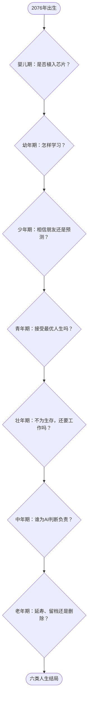

# 《余生协议：一个普通人的100年》游戏总览

## 一句话故事

2076年，一个普通孩子出生在AI已经接管知识、劳动和医疗基础设施的城市。玩家陪伴这个人活过一百年，并在一次次便利与自主、预测与选择、数字永生与真实死亡之间作出决定。

游戏最终追问：**当AI能够替你完成几乎所有事情，究竟还有什么必须由你亲自经历和承担？**

## 世界背景

- **时间起点**：2076年。
- **主要地点**：海岚市，一座高度自动化、实行全民基础服务的沿海城市。
- **社会状态**：知识芯片、生成式教育、机器人劳动、沉浸式远程社交、精准医疗和数字人格都已普及。
- **主要矛盾**：技术让生活更安全、更长久，但社会尚未解决数据所有权、算法责任、阶层差异和数字人格权利问题。
- **政策演化**：玩家无法凭一己之力改变社会，但其经历会与成千上万起类似事件汇合，成为推动政策变化的案例。

## 主要人物

### 林一（玩家角色）

姓名、性别和外观可以自定义。“林一”是剧本默认名，象征被系统编号的普通人，也象征每个人只有一次的人生。

### 周岚（母亲／主要监护人）

林一出生时35岁。相信技术能够改善普通家庭的生活，但始终担心孩子失去选择权。她在婴儿期替林一作出第一个决定，并在中年章节成为医疗AI事件的中心人物。

### 小满（现实朋友）

林一幼年时期认识的男孩，与林一同岁。敏感、好奇、不完全服从系统，长大后逐渐成为线下社区的组织者，是林一与现实世界之间最重要的联系。小满可能成为相识一生的男性朋友，也可能在少年期彻底离开林一的人生。默认剧本将两人的关系写作友情与共同成长，不设置恋爱分支。

### “栖”（个人AI）

“栖”最初是学习和健康助手，之后依次成为升学顾问、职业规划者、医疗代理人和遗嘱执行者。

“栖”的说话方式会被玩家塑造：

- AI依赖高时，它使用确定句：“这是最优方案。”
- 人机共生时，它使用提问句：“你希望我提供证据，还是建议？”
- 自主性高时，它会在作答前询问：“你是否授权我介入？”
- 老年时，它可能已经非常像林一，也可能仍只是一个被限制权限的工具。

## 章节时间线

1. [婴儿期：出生协议](01-婴儿期.md)——2076年，0岁。
2. [幼年期：消失的鸟](02-幼年期.md)——2084年，8岁。
3. [少年期：被预测的人](03-少年期.md)——2092年，16岁。
4. [青年期：94.7%的人生](04-青年期.md)——2099年，23岁。
5. [壮年期：最后一个工作日](05-壮年期.md)——2114年，38岁。
6. [中年期：谁为正确负责](06-中年期.md)——2134年，58岁。
7. [老年期：余生协议](07-老年期.md)——2174年，98岁。
8. [结局剧本](08-结局.md)。
9. [分支变量与延迟回响](09-分支变量与回响.md)。

## 叙事结构

游戏采用“汇流式分支”，而不是无限扩张的树状剧情：

- 每一章都有一个所有玩家都会面对的核心事件。
- 每个事件提供三个价值取向不同的选择。
- 选择之后时间继续前进，但会写入人生状态和剧情标记。
- 旧选择会在多年后改变人物对白、成功条件、场景人物和可选行动。
- 没有即时显示的“正确答案”，只有私人后果和社会回声。

## 人生状态

游戏内部记录五项可见状态：

- **自主**：是否保有决定和拒绝的能力。
- **辨识**：是否能理解、验证和纠正AI。
- **联结**：是否拥有需要真实付出的人际关系。
- **保障**：健康、财富、住房和制度资源。
- **意义**：是否知道自己为何学习、工作和生活。

另有一项隐藏状态：

- **公共影响力**：主角的个人遭遇能否进入公共讨论，并推动制度改变。

数值只用于分支判断。正式游戏不必向玩家展示具体加减分，可以通过人物态度、新闻标题、房间变化和“栖”的语气暗示状态。

## 每章统一流程

1. **年代蒙太奇**：用20—30秒展示世界和主角的变化。
2. **生活场景**：先让玩家感受普通生活，不立即抛出政策概念。
3. **核心冲突**：AI给出看似合理的方案。
4. **自由查看**：玩家可以阅读证据、新闻、人物消息和历史选择。
5. **三选一**：每个选择分别倾向效率、共生或自主，但都必须有真实代价。
6. **私人后果**：呈现家人、朋友和主角生活的变化。
7. **社会回声**：用新闻、政策通知或公共讨论显示相似事件如何影响制度。
8. **时间跃迁**：保留一个视觉物件进入下一章，例如芯片光点、鸟类记录、小满的纸条或母亲的语音。

## 整体故事线

## 基调与表现原则

- 未来世界应当美丽、便利且可信，不能只表现为压抑的反乌托邦。
- AI不是反派。“栖”始终真诚地试图帮助林一，问题在于帮助是否逐渐替代了选择。
- 每个选项都需要有合理支持者，不设置明显的善恶按钮。
- 普通人的情感是主线，政策内容通过具体事件表现，不让角色直接背诵概念。
- 结局评价回答“你成为了怎样的人”，而不是简单显示成功或失败。
